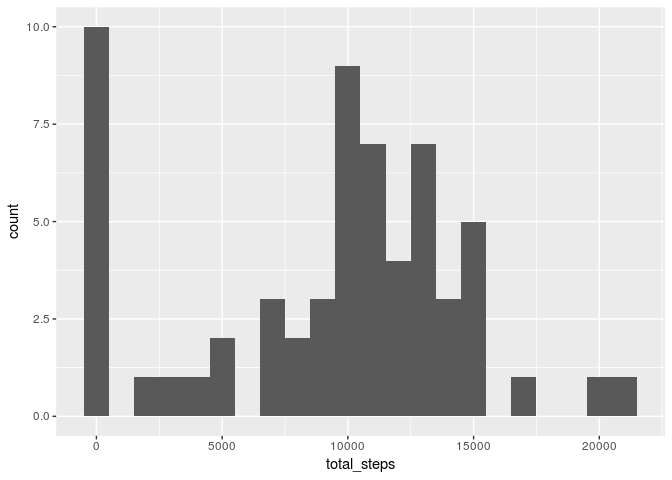
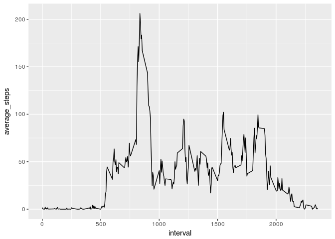
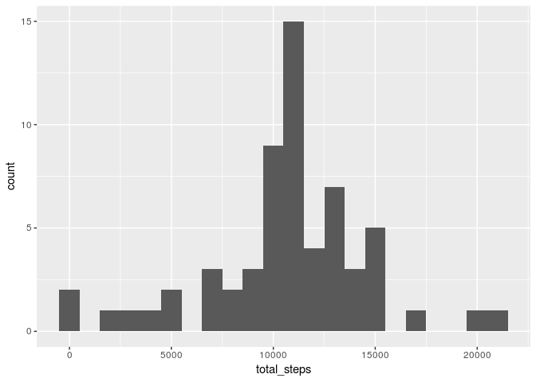
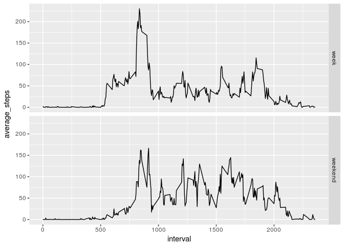

# Reproducible Research: Peer Assessment 1


## Loading and preprocessing the data
Firstly load the data from the zip file:  
- Set the working directory 
- Create a connection to the zip file  
- Load data from activity.csv into activity variable  


```r
library(dplyr)
```

```
## 
## Attaching package: 'dplyr'
```

```
## The following objects are masked from 'package:stats':
## 
##     filter, lag
```

```
## The following objects are masked from 'package:base':
## 
##     intersect, setdiff, setequal, union
```

```r
library(lubridate)
```

```
## 
## Attaching package: 'lubridate'
```

```
## The following object is masked from 'package:base':
## 
##     date
```

```r
library(ggplot2)
setwd("~/Desktop/coursera/Assignments/REPRES/RepData_PeerAssessment1")
activity <- read.csv (unz("activity.zip","activity.csv"))
```

Next explore the basic features:

```r
str(activity)
```

```
## 'data.frame':	17568 obs. of  3 variables:
##  $ steps   : int  NA NA NA NA NA NA NA NA NA NA ...
##  $ date    : Factor w/ 61 levels "2012-10-01","2012-10-02",..: 1 1 1 1 1 1 1 1 1 1 ...
##  $ interval: int  0 5 10 15 20 25 30 35 40 45 ...
```

```r
head(activity)
```

```
##   steps       date interval
## 1    NA 2012-10-01        0
## 2    NA 2012-10-01        5
## 3    NA 2012-10-01       10
## 4    NA 2012-10-01       15
## 5    NA 2012-10-01       20
## 6    NA 2012-10-01       25
```


Recast the date variable as a date:

```r
activity <- mutate(activity, date = ymd(date))
```

## What is mean total number of steps taken per day?
Calculate the mean total number of steps taken per day by firstly grouping by day. Ignore any NA values.

```r
total_steps_per_day <- activity %>% group_by(date) %>% summarize(total_steps=sum(steps, na.rm=TRUE))
```

Now plot the histogram of total steps over the measurement period changing the bin width from 30 to 100:


```r
qplot(x=total_steps,data=total_steps_per_day, bins=100)
```

<!-- -->

Calculate the mean and median of the total_steps:

```r
mean_steps <- mean(total_steps_per_day$total_steps)
median_steps <- median(total_steps_per_day$total_steps)
```

The mean is 9,354.23 and the median is 10,395.


## What is the average daily activity pattern?
Next group by the interval and make a line plot of the average steps taken cross all days in that interval.


```r
average_interval <- activity %>% group_by(interval) %>% summarize(average_steps=mean(steps, na.rm=TRUE))

qplot(x=interval, y=average_steps, data=average_interval, geom="path" )
```

<!-- -->


Next the maximum steps:


```r
max_steps <-average_interval[which.max(average_interval$average_steps),]
```

The interval with the maximum steps on average is 835  


## Imputing missing values
Firstly let's calculate the number of NAs

```r
print(sum(is.na(activity$steps)))
```

```
## [1] 2304
```

Fill the NAs with the mean for the equivalent 5 minute interval and add to a new dataset.  

```r
completedata <- activity %>% group_by(interval)
completedata <- mutate(completedata, steps= replace(steps,list=is.na(steps), values=mean(steps, na.rm=TRUE)))
```

Make a new histogram of the total steps for the complete data.  

```r
completedataplot <- completedata %>% group_by(date) %>% summarize(total_steps=sum(steps))
qplot(x=total_steps,data=completedataplot, bins=100)
```

<!-- -->


The new mean and median are:  

```r
new_mean_steps <- mean(completedataplot$total_steps)
new_median_steps <- median(completedataplot$total_steps)
```

New mean = 10,766.19  
New median = 10,766.19

The impact on each of the removal of missing data is as follows  

Difference to mean = 1,411.959  
Difference to median = 371.1887  

## Are there differences in activity patterns between weekdays and weekends?

Add the new factor variable to completedata  

```r
completedata$weekday <- as.factor(ifelse(wday(completedata$date)==1|wday(completedata$date)==7,"weekend","week"))
```

and do a panel plot of weekend v weekday  


```r
new_average_interval <- completedata %>% group_by(weekday, interval) %>% summarize(average_steps=mean(steps))

qplot(x=interval, y=average_steps, data=new_average_interval, geom="path", facets = weekday~. )
```

<!-- -->

